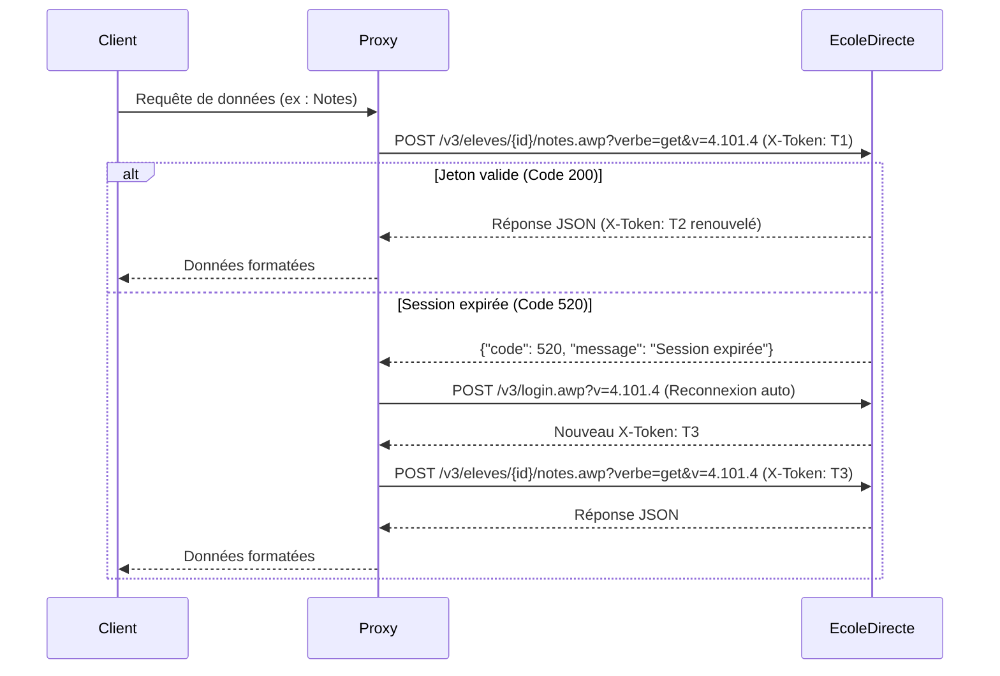

# 01. Architecture et Authentification

## 1. Principes Généraux du Protocole

L'API d'ÉcoleDirecte (version 3) est une API REST privée basée sur HTTPS.

- **URL de base** : `https://api.ecoledirecte.com/v3/`
- **Méthode HTTP prédominante** : `POST` (utilisée pour les lectures et écritures).
- **Paramètres d'URL obligatoires** : La plupart des endpoints exigent les paramètres de requête `verbe` et `v` dans l'URL (ex : `?verbe=get&v=4.101.4` ou `?verbe=put&v=4.101.4`). Leur omission renvoie le code applicatif `225` (*Paramètres spécifiés incorrects !*).
- **Format d'encodage des données** : Les requêtes transmettent leur charge utile (payload) sous la forme d'un champ de formulaire URL-encodé nommé `data`, dont la valeur est un objet JSON sérialisé :
  ```http
  POST /v3/login.awp?v=4.101.4 HTTP/1.1
  Host: api.ecoledirecte.com
  Content-Type: application/x-www-form-urlencoded
  User-Agent: Mozilla/5.0 (Windows NT 10.0; Win64; x64) AppleWebKit/537.36 (KHTML, like Gecko) Chrome/128.0.0.0 Safari/537.36

  data=%7B%22identifiant%22%3A%22utilisateur%22%2C%22motdepasse%22%3A%22motdepasse%22%7D
  ```

### En-têtes HTTP Requis

| En-tête | Type / Format | Description |
| :--- | :--- | :--- |
| `User-Agent` | Chaîne | Requis : User-Agent de navigateur moderne (ex : Chrome/Windows) pour éviter les rejets pare-feu. |
| `Content-Type` | Chaîne | `application/x-www-form-urlencoded` |
| `Accept` | Chaîne | `application/json, text/plain, */*` |
| `X-Token` | UUID / Chaîne | Jeton de session retourné lors de l'authentification. Requis pour toute requête ultérieure. |

---

## 2. Processus d'Authentification Initiale

### Étape 1 : Initialisation GTK (Recommandé)
- **Requête** : `GET /v3/login.awp?gtk=1&v=4.101.4`
- **Rôle** : Permet d'initialiser les cookies de session et le jeton de pré-authentification `x-gtk`.

### Étape 2 : Authentification par identifiants
- **Endpoint** : `POST /v3/login.awp?v=4.101.4`

#### Corps de la requête
```json
{
  "identifiant": "identifiant_utilisateur",
  "motdepasse": "mot_de_passe_utilisateur",
  "isReconnexion": false,
  "fa": []
}
```

#### Réponse : Cas 1 - Connexion directe réussie (Code 200)

```json
{
  "code": 200,
  "token": "a1b2c3d4-e5f6-7890-abcd-ef1234567890",
  "message": "",
  "data": {
    "accounts": [
      {
        "id": 12345,
        "idLogin": 67890,
        "identifiant": "identifiant_utilisateur",
        "typeCompte": "E",
        "nom": "DUPONT",
        "prenom": "Alexandre",
        "nomEtablissement": "Lycée Saint-Exupéry",
        "profil": {
          "sexe": "M",
          "classe": {
            "id": 101,
            "code": "TG1",
            "libelle": "Terminale Générale 1"
          }
        },
        "modules": [
          { "code": "NOTES", "enable": true },
          { "code": "CAHIER_DE_TEXTES", "enable": true },
          { "code": "EDT", "enable": true },
          { "code": "MESSAGERIE", "enable": true },
          { "code": "VIE_SCOLAIRE", "enable": true }
        ]
      }
    ]
  }
}
```

---

## 3. Double Authentification (2FA / Challenge QCM)

Lorsque la double authentification est demandée par ÉcoleDirecte, le serveur renvoie le code statut `250` accompagné d'une question et d'un ensemble de propositions encodées en Base64.

### Réponse avec défi 2FA (Code 250) :

```json
{
  "code": 250,
  "token": "jeton_temporaire_challenge",
  "message": "Double authentification nécessaire",
  "data": {
    "question": "UXVlbGxlIGVzdCBsYSBjb3VsZXVyIGR1IGNoZXZhbCBibGFuYyA/",
    "propositions": [
      "Um91Z2U=",
      "QmxhbmM=",
      "Tm9pcg==",
      "VmVydA=="
    ]
  }
}
```

### Décodage du Challenge Base64 :
- Question décodée : `"Quelle est la couleur du cheval blanc ?"`
- Propositions décodées : `["Rouge", "Blanc", "Noir", "Vert"]`

### Endpoint de validation : `POST /v3/connexion/doubleauth.awp?v=4.101.4`

#### Corps de la requête
```json
{
  "choix": "QmxhbmM=",
  "identifiant": "identifiant_utilisateur",
  "motdepasse": "mot_de_passe_utilisateur"
}
```

#### En-têtes obligatoires :
- `X-Token: jeton_temporaire_challenge`

#### Réponse après validation réussie (Code 200) :
Renvoie le jeton de session définitif et l'objet complet `data.accounts`.

---

## 4. Cycle de Vie et Renouvellement du Jeton (`X-Token`)



### Points Clés :
1. **Renouvellement continu (Sliding Expiration)** : Chaque réponse réussie d'ÉcoleDirecte fournit un nouveau jeton dans le champ racine `token`. Il doit écraser l'ancien jeton stocké pour les requêtes suivantes.
2. **Gestion de l'erreur 520** : Le code `520` signifie que la session a expiré côté serveur. Le client doit relancer automatiquement la séquence d'authentification complète sans interrompre l'expérience utilisateur.
